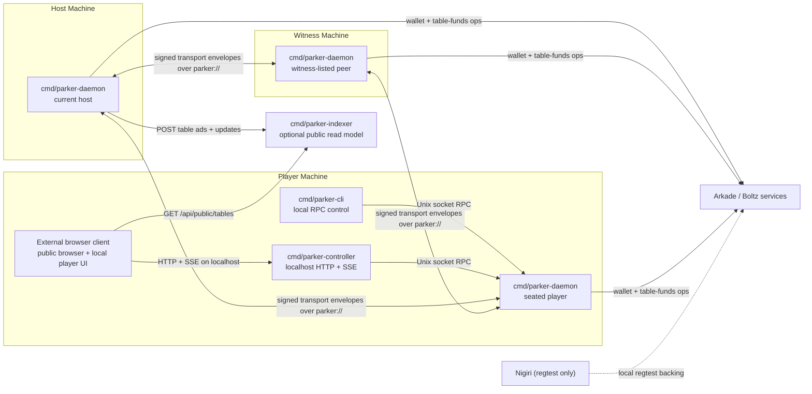

# Architecture

This document describes the architecture in this repository.

For protocol details, see [protocol.md](./protocol.md). For the dealerless hand flow, see [dealerless.md](./dealerless.md). For chip and wallet movement, see [money-flows.md](./money-flows.md). For guarantees and trust assumptions, see [trust-model.md](./trust-model.md).

## Overview

Parker runs as a Go-first daemon workspace:

- `cmd/parker-daemon` runs the gameplay and settlement daemon
- `cmd/parker-cli` controls a local daemon over Unix-socket RPC
- `cmd/parker-controller` exposes localhost HTTP and SSE backed by that same daemon RPC
- `cmd/parker-indexer` stores public advertisements and public updates for discovery
- external browser clients can talk to the localhost controller
- `scripts/bin/*` wrappers build and run the Go binaries on demand

The peer runtime is coordinator-led and dealerless:

- each participant runs a local daemon
- the current host coordinates joins, actions, failover, event append order, and replication
- hidden cards flow through `dealerless-transcript-v1`, not a host-dealt deck seed
- only the owning seat stores its own hole cards in plaintext locally after private delivery
- non-host peers replay the accepted hand transcript, public state, custody history, and historical ledger before persistence
- peer listeners expose a direct TCP transport on advertised `parker://` endpoints
- public discovery remains optional through the indexer
- the browser stays outside daemon custody and peer-to-peer transport

Daemons advertise direct peer endpoints shaped like `parker://host:port` and exchange signed transport envelopes over the framed TCP transport implemented in the daemon.

## Recovery Proof Surfaces

Deterministic pot resolution uses pre-signed CSV recovery bundles over the shared pot exit instead of an output-inspecting tapscript branch.

Accepted custody history has three proof surfaces:

- `CustodyProof.SettlementWitness` for ordinary real Ark batch finalization
- stored `CustodyProof.RecoveryBundles` plus an executed `CustodyProof.RecoveryWitness` for deterministic heads-up contested-pot recovery after the shared pot CSV delay `U`
- stored `CustodyProof.ChallengeBundle` plus an executed `CustodyProof.ChallengeWitness` for `turn-challenge-open`, challenge-resolved actions, challenge-resolved timeouts, and challenge escapes

The recovery path is intentionally narrow:

- heads-up only
- only deterministic money-resolving states get stored bundles
- action timeout that auto-folds
- showdown reveal/showdown timeout that kills the missing player
- settled `showdown-payout` timeout

Auto-check states fail closed until a later objective deadline exists. When recovery does apply, it recreates the same ordinary winner-owned stack refs that the cooperative successor would have produced.

## Practical Repo Mapping

- `cmd/parker-daemon` plus [internal/meshruntime/runtime.go](../internal/meshruntime/runtime.go), [internal/meshruntime/api.go](../internal/meshruntime/api.go), and [internal/meshruntime/transport_wire.go](../internal/meshruntime/transport_wire.go) are the gameplay, local-RPC, and peer-transport runtime
- `cmd/parker-cli` plus [internal/client.go](../internal/client.go) are the local CLI control surface
- `cmd/parker-controller` plus [internal/controller/app.go](../internal/controller/app.go) are the localhost browser bridge
- `cmd/parker-indexer` plus [internal/indexer/app.go](../internal/indexer/app.go) are the optional public ingest/read model
- [internal/storage/store.go](../internal/storage/store.go) provides the runtime and indexer storage backends
- [internal/settlementcore/core.go](../internal/settlementcore/core.go) implements canonical JSON hashing and signatures
- [internal/tablecustody](../internal/tablecustody) owns custody state hashing, transition validation, side-pot claims, and exit-proof material
- [internal/meshruntime/custody_recovery.go](../internal/meshruntime/custody_recovery.go) owns deterministic recovery bundle generation, CSV-leaf selection, fallback execution, and offline witness replay
- [internal/wallet/runtime.go](../internal/wallet/runtime.go), [internal/wallet/custody_exit.go](../internal/wallet/custody_exit.go), and [internal/wallet/chain_status.go](../internal/wallet/chain_status.go) own Ark wallet access, signer sessions, unilateral exit execution, and explorer-backed chain-status lookups for challenge replay/readiness
- [internal/game](../internal/game) contains the Hold'em rules engine and N-player money evaluation
- browser clients are maintained outside this repository

## Component Roles

### Daemon process

`cmd/parker-daemon` starts [internal/daemon/service.go](../internal/daemon/service.go), which wraps [internal/daemon/proxy_daemon.go](../internal/daemon/proxy_daemon.go), the daemon runtime adapter in [internal/daemon/runtime_adapter.go](../internal/daemon/runtime_adapter.go), and the gameplay/custody runtime in [internal/meshruntime/runtime.go](../internal/meshruntime/runtime.go).

This process owns:

- the profile-local Unix socket used by the CLI and controller
- the local watch stream (`status`, `watch`, `log`, `state`)
- peer-to-peer table replication and host polling
- wallet access and table-funds operations
- local persistence for profiles, peers, tables, events, snapshots, and private hand state

This is the only component that can:

- create tables
- accept joins and actions
- append signed events
- build snapshots
- execute carry-forward acknowledgments (`meshRenew`), cash-out, and emergency-exit operations

### CLI process

`cmd/parker-cli` is a thin local control surface. It talks only to the local daemon through the profile socket:

- `<daemonDir>/<profile>.sock`

The command groups are:

- `bootstrap`
- `wallet`
- `network`
- `table`
- `funds`
- `daemon`
- `interactive`

It does not participate in peer-to-peer table sync directly.

### Local controller service

`cmd/parker-controller` is a loopback-only Go `net/http` service that adapts daemon RPC into browser-safe HTTP and SSE.

It exposes:

- structured `GET` and `POST` routes under `/api/local`
- `GET /api/local/profiles/{profile}/watch` as an SSE bridge over daemon `watch`
- proxy `GET /api/public/tables` reads to the configured indexer

It also enforces:

- loopback binding by default
- allowed-origin checks
- the `X-Parker-Local-Controller` browser header requirement

It does not:

- own keys
- sign protocol objects
- join peer-to-peer table sync
- reimplement gameplay or settlement logic

### Runtime roles and mode labels

The daemon process can be started with a mode label (`player` by default; the CLI and controller can also pass `host`, `witness`, or `indexer`), but live table authority is derived from table state rather than from a separate binary or peer protocol.

Runtime behavior is:

- the current host is the peer recorded in `table.CurrentHost`
- witness-listed peers are the peers recorded in `table.Witnesses`
- seated players are the peers recorded in `table.Seats`
- the host creates tables, accepts joins, coordinates gameplay, appends events, and replicates table state
- witness-listed peers store replicated tables and can take over after stale host heartbeats
- seated players own bankroll, join tables, submit actions, and execute local funds operations

If witnesses are configured, only witnesses take over automatically. If no witnesses are configured, the seated player with the lowest peer ID becomes the failover candidate.

The CLI accepts `--mode indexer` for compatibility, but the public read path in this repository is the standalone `cmd/parker-indexer` service.

### Optional indexer

`cmd/parker-indexer` is a standalone Go `net/http` service with a public read model stored through [internal/storage/store.go](../internal/storage/store.go).

It accepts:

- `POST /api/indexer/table-ads`
- `POST /api/indexer/table-updates`

And it serves:

- `GET /api/public/tables`
- `GET /api/public/tables/{tableId}`

The indexer does not participate in gameplay authority or money movement. It only stores and serves public information.

### Browser clients

External browser clients typically run in two practical modes:

- public spectator mode backed by the indexer
- local player-control mode backed by the localhost controller

In controller mode the browser can:

- list local profiles
- inspect or start the local daemon
- request wallet actions
- create or join tables
- submit gameplay actions
- request carry-forward (`meshRenew`), cash-out, or emergency exit

Even in controller mode, the browser stays outside daemon custody:

- it does not hold wallet, protocol, or transport private keys
- it does not read profile files or Unix sockets
- it does not talk to peer `parker://` transport directly

### Arkade and Nigiri dependencies

The runtime uses Arkade-backed wallet and table-funds operations for:

- faucet/onboarding flows
- buy-in funding verification and lock
- custody transition settlement and replay verification
- cash-out
- emergency exit

In local regtest, Nigiri provides the local backing services.

## Runtime Boundaries

### Daemon authority boundary

Gameplay authority lives in the daemon, not in the browser or indexer.

- the daemon decides whether joins and actions are accepted
- the daemon builds public state, events, and snapshots
- the daemon persists the local table copy and funds state

### Local control boundary

The CLI and controller cross a local-only boundary:

- the CLI uses Unix-socket NDJSON RPC
- the controller uses localhost HTTP and SSE
- the daemon executes the actual wallet, network, and table operations

No remote peer talks to another peer's CLI or controller.

### Peer replication boundary

The Go runtime exchanges newline-delimited [TransportEnvelope](../internal/transport_types.go) JSON over direct TCP connections rather than `/native/*` HTTP routes.

Request message types are:

- `peer.manifest.get`
- `table.state.pull`
- `table.join.request`
- `table.action.request`
- `table.funds.request`
- `table.custody.request`
- `table.custody.sign.request`
- `table.custody.signer.prepare.request`
- `table.custody.signer.start.request`
- `table.custody.signer.nonces.request`
- `table.custody.signer.aggregated_nonces.request`
- `table.hand.request`
- `table.state.push`

Responses are:

- `peer.manifest`
- `table.state.push`
- `table.join.response`
- `table.action.response`
- `table.funds.response`
- `table.custody.response`
- `table.custody.sign.response`
- `table.custody.signer.prepare.response`
- `table.custody.signer.start.response`
- `table.custody.signer.nonces.response`
- `table.custody.signer.aggregated_nonces.response`
- `table.hand.response`
- `ack`
- `nack`

Advertised peer endpoints use `parker://<host>:<port>`. The dialer also accepts `tcp://` and `tor://` bootstrap targets, and onion targets route through Tor when enabled.

The host remains authoritative for joins, actions, and routine table replication. Other peers poll the host table when they are not the current host.

### Public read boundary

The indexer and public UI sit outside gameplay authority:

- hosts can publish public advertisements and snapshots to the indexer
- browser clients read those routes over HTTP
- failures or staleness there do not change local wallet custody

## Component Diagram

## Example Deployment Topologies

### Minimal private table

A minimal private heads-up table can run with:

- one daemon that hosts and also seats into the table
- one second player daemon
- no indexer
- no browser client

This can function for direct-invite play, but it has weaker recovery and no public discovery.

### Public table with witnesses and spectators

A public-facing topology is:

- one host daemon
- one or more player daemons
- zero or more witness daemons
- one optional local controller per player machine
- optional indexer
- optional external browser client

This gives a public discovery path while keeping gameplay and funds actions in the daemons.

### Local regtest harnesses

The repository exercises these local shapes:

- `make local` rebuilds the local binaries, starts Nigiri, the indexer, the localhost controller, and three local daemons: `witness`, `alice`, and `bob`; `HOST_PROFILE` selects which player runs in host mode
- `make deps`, `make host`, `make witness`, `make alice`, `make bob`, and their matching `-down` targets let you manage the local regtest services individually
- `make fund-alice` and `make fund-bob` bootstrap those player profiles if needed, faucet funds, and onboard them
- `make poker-regtest-round` starts Nigiri, the indexer, four Go daemons, funds the players, creates a table, auto-plays a hand, and cashes both players out
- `make poker-regtest-round-recovery` creates a contested pot, forces a deterministic timeout state, stops the defaulting peer plus Ark/indexer services, waits for `U`, and confirms that the survivor finishes from a stored recovery bundle with `RecoveryWitness`

## Gameplay / Data Flows

### Table creation and seating

1. A local CLI or controller asks the host daemon to create a table.
2. The host daemon appends `TableAnnounce`, stores the invite code, and optionally builds an advertisement.
3. If the table is public and an indexer is configured, the daemon publishes the advertisement and public snapshot.
4. A player daemon decodes the invite, selects unreserved funding refs, reserves them locally, builds a wallet-signed identity binding, and sends `table.join.request` to the host's `parker://` endpoint.
5. The host daemon validates the binding, live peer identity, and funded buy-in refs, verifies those refs on Ark in real-settlement mode, finalizes the `buy-in-lock` custody transition, appends `SeatLocked`, and marks the table ready when seat count is reached.
6. Once the table is ready, the host builds a snapshot and starts the first hand.

### Gameplay loop

1. The host daemon starts the hand from the latest accepted custody state, posts blinds through custody, coordinates the dealerless transcript phases, and records the resulting transcript root in public state.
2. For each actionable turn, the host builds the full finite menu locally, replicates only `PendingTurnMenuPublic`, and stores the full `LocalTurnBundleCache` only on the acting player and current host.
3. The acting player chooses a candidate by sending `ActionChooseRequest` with `candidateHash` plus `SelectionAuth`.
4. The host validates the signed binding, locks that exact candidate, persists the public lock state, replicates exactly one selected bundle, and replies with `ActionLockedAck`.
5. The acting player settles the locked bundle locally and sends `ActionSettlementRequest` carrying the fully settled transition and witness material. The host validates it against the locked bundle, publishes the accepted `action` transition, then appends `PlayerAction`.
6. If the turn remains unlocked through the action deadline and the table uses `chain-challenge`, the host or a successor opens the precomputed challenge path. If the turn is locked but settlement stalls past `settlementDeadlineAt`, the current host or successor settles the replicated selected bundle instead.
7. Each receiving daemon verifies the accepted hand transcript, public replay, custody history, approval signatures, and Ark-linked proof material before persisting the replicated table.
8. When the hand settles, the host finalizes payout custody if the latest custody state does not already match the settled public money state, then appends `HandResult`, builds a snapshot, and schedules the next hand.
9. Cash-out and emergency-exit requests finalize custody first and then append a derived local `arkade-table-funds/v1` receipt for wallet availability and operator/debug surfaces.

### Chain-challenge flow

When `turnTimeoutMode = "chain-challenge"`, the gameplay loop also carries a deterministic onchain fallback:

1. The host precomputes a local-only `ChallengeEnvelope` for the active finite turn menu.
2. The challenge path is used only while the turn is still unlocked. Once `SelectionAuth` locks a candidate, recovery uses the locked selected bundle rather than timeout substitution.
3. The `turn-challenge-open` bundle spends every live stack ref and pot ref through its predeclared `D` locktime leaf and reissues the full live bankroll into one `TurnChallengeRef`.
4. Option-resolution bundles and the timeout-resolution bundle spend `TurnChallengeRef` through its cooperative player-only leaf.
5. The escape bundle spends `TurnChallengeRef` through its CSV leaf.
6. Local escape readiness for block-based CSV comes from the wallet runtime's explorer-backed chain-status surface, which queries the configured explorer for tip height and transaction confirmation heights.
7. Accepted replay uses those same live chain lookups for exact block-height verification and fails closed when the required heights cannot be verified.

That explorer-backed chain-status surface uses:

- `GET {ExplorerURL}/blocks/tip/height` for local tip height
- `GET {ExplorerURL}/tx/{txid}/status` for transaction confirmation status and block height
- a short local tip cache as a fallback when a live tip request fails

### Public read flow

For public tables, the host daemon can publish:

- signed table advertisements
- public table snapshots
- public hand updates

The indexer stores those records, and browser clients read that model. None of those steps give the indexer authority over gameplay or keys.

## Failure / Recovery Paths

### Between-hand host loss

If the host stops updating `LastHostHeartbeatAt`:

- witnesses can take over when configured
- if no witnesses are configured, the seated player with the lowest peer ID is the failover candidate
- the successor host appends `HostRotated`
- the next hand starts from the latest accepted custody checkpoint and replay-valid derived state

### Mid-hand host loss

If the host disappears during an active hand:

- the failover daemon appends `HostRotated`
- it syncs the best known accepted table and replays custody, transcript, and public state to decide whether the hand can continue
- if the turn is unlocked, it resumes from the compact public menu and can continue locking the action or open `turn-challenge-open` after the action deadline
- if the turn is locked, it continues from the replicated selected bundle and lock metadata
- if the acting player already settled, it publishes that exact settled transition
- if the acting player disappears before settlement, it can settle the replicated selected bundle after `settlementDeadlineAt`
- if required protocol records are missing or invalid, it appends `HandAbort`
- it returns to the latest replay-valid custody-backed table state when abort is required

### Deterministic money recovery

If a hand reaches an objectively determined money result but cooperative Ark finalization cannot complete:

- the source accepted transition already carries the fully signed recovery PSBT over the shared pot CSV exit
- the host keeps retrying the normal path until the bundle's `EarliestExecuteAt`
- after `U`, the host can execute the stored PSBT through the unilateral-exit broadcaster
- the accepted successor is the ordinary semantic `timeout` or `showdown-payout` transition, but it carries `RecoveryWitness` instead of `SettlementWitness`

This is an eventual-recovery design, not an instant-at-`D` design. Deterministic contested pots recover after `U`, while non-deterministic or auto-check states fail closed.

## Relationship To Other Docs

- [protocol.md](./protocol.md): controller routes, local RPC surface, peer transport, signed objects, and public-read protocol
- [dealerless.md](./dealerless.md): dealerless transcript flow, private card delivery, board opening, showdown, and failover semantics
- [trust-model.md](./trust-model.md): guarantees, trust assumptions, and operational failure consequences
