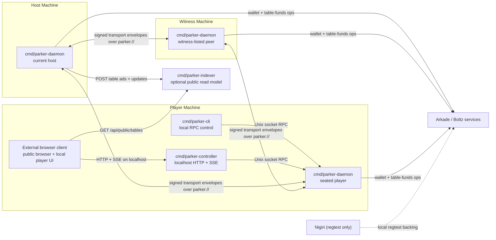

# Current Architecture

This document describes the architecture implemented today in this repository. It is intentionally current-state only.

For protocol details, see [protocol.md](./protocol.md). For guarantees and trust assumptions, see [trust-model.md](./trust-model.md).

## Overview

Parker currently runs as a Go-first daemon workspace:

- `cmd/parker-daemon` runs the gameplay and settlement daemon
- `cmd/parker-cli` controls a local daemon over Unix-socket RPC
- `cmd/parker-controller` exposes localhost HTTP and SSE backed by that same daemon RPC
- `cmd/parker-indexer` stores public advertisements and public updates for discovery
- external browser clients can talk to the localhost controller
- `scripts/bin/*` wrappers build and run the Go binaries on demand

The peer runtime is host-authoritative today:

- each participant runs a local daemon
- the host accepts joins and actions, appends events, builds snapshots, and replicates table state
- peer listeners expose a direct TCP transport on advertised `parker://` endpoints
- public discovery remains optional through the indexer
- the browser stays outside daemon custody and peer-to-peer transport

Daemons now advertise direct peer endpoints shaped like `parker://host:port` and exchange signed transport envelopes over the framed TCP transport implemented in the daemon.

## Practical Repo Mapping

- `cmd/parker-daemon` plus [`internal/mesh_runtime.go`](../internal/mesh_runtime.go) and [`internal/transport_wire.go`](../internal/transport_wire.go) are the gameplay and peer-transport runtime
- `cmd/parker-cli` plus [`internal/client.go`](../internal/client.go) are the local CLI control surface
- `cmd/parker-controller` plus [`internal/controller/app.go`](../internal/controller/app.go) are the localhost browser bridge
- `cmd/parker-indexer` plus [`internal/indexer/app.go`](../internal/indexer/app.go) are the optional public ingest/read model
- [`internal/storage/store.go`](../internal/storage/store.go) provides the runtime and indexer storage backends
- [`internal/settlementcore/core.go`](../internal/settlementcore/core.go) implements canonical JSON hashing and signatures
- [`internal/game`](../internal/game) contains the current heads-up Hold'em engine
- browser clients are maintained outside this repository

## Component Roles

### Daemon process

`cmd/parker-daemon` starts [`internal/daemon.Service`](../internal/daemon/service.go), which currently wraps [`internal.ProxyDaemon`](../internal/proxy_daemon.go), the daemon runtime adapter in [`internal/daemon_runtime_adapter.go`](../internal/daemon_runtime_adapter.go), and the gameplay engine in [`internal/mesh_runtime.go`](../internal/mesh_runtime.go).

This process owns:

- the profile-local Unix socket used by the CLI and controller
- the local watch stream (`status`, `watch`, `log`, `state`)
- peer-to-peer table replication and host polling
- wallet access and table-funds operations
- local persistence for profiles, peers, tables, events, snapshots, and private hand state

This is the only component that can:

- create tables
- accept joins and actions
- append signed events
- build snapshots
- execute renew, cash-out, and emergency-exit operations

### CLI process

`cmd/parker-cli` is a thin local control surface. It talks only to the local daemon through the profile socket:

- `<daemonDir>/<profile>.sock`

The current command groups are:

- `bootstrap`
- `wallet`
- `network`
- `table`
- `funds`
- `daemon`
- `interactive`

It does not participate in peer-to-peer table sync directly.

### Local controller service

`cmd/parker-controller` is a loopback-only Go `net/http` service that adapts daemon RPC into browser-safe HTTP and SSE.

It exposes:

- structured `GET` and `POST` routes under `/api/local`
- `GET /api/local/profiles/{profile}/watch` as an SSE bridge over daemon `watch`
- proxy `GET /api/public/tables` reads to the configured indexer

It also enforces:

- loopback binding by default
- allowed-origin checks
- the `X-Parker-Local-Controller` browser header requirement

It does not:

- own keys
- sign protocol objects
- join peer-to-peer table sync
- reimplement gameplay or settlement logic

### Runtime roles and mode labels

The daemon process can be started with a mode label (`player` by default; the CLI and controller can also pass `host`, `witness`, or `indexer`), but live table authority is derived from table state rather than from a separate binary or peer protocol.

Current runtime behavior is:

- the current host is the peer recorded in `table.CurrentHost`
- witness-listed peers are the peers recorded in `table.Witnesses`
- seated players are the peers recorded in `table.Seats`
- the host creates tables, accepts joins, sequences gameplay, appends events, and replicates table state
- witness-listed peers store replicated tables and can take over after stale host heartbeats
- seated players own bankroll, join tables, submit actions, and execute local funds operations

If witnesses are configured, only witnesses take over automatically. If no witnesses are configured, the seated player with the lowest peer ID becomes the failover candidate.

The CLI still accepts `--mode indexer` for compatibility, but the actual public read path in this repository is the standalone `cmd/parker-indexer` service.

### Optional indexer

`cmd/parker-indexer` is a standalone Go `net/http` service with a public read model stored through [`internal/storage/store.go`](../internal/storage/store.go).

It accepts:

- `POST /api/indexer/table-ads`
- `POST /api/indexer/table-updates`

And it serves:

- `GET /api/public/tables`
- `GET /api/public/tables/{tableId}`

The indexer does not participate in gameplay authority or money movement. It only stores and serves public information.

### Browser clients

External browser clients typically run in two practical modes:

- public spectator mode backed by the indexer
- local player-control mode backed by the localhost controller

In controller mode the browser can:

- list local profiles
- inspect or start the local daemon
- request wallet actions
- create or join tables
- submit gameplay actions
- request renew, cash-out, or emergency exit

Even in controller mode, the browser is still outside daemon custody:

- it does not hold wallet, protocol, or transport private keys
- it does not read profile files or Unix sockets
- it does not talk to peer `parker://` transport directly

### Arkade and Nigiri dependencies

The current runtime uses Arkade-backed wallet and table-funds operations for:

- faucet/onboarding flows
- buy-in and funds tracking
- renewals
- cash-out
- emergency exit

In local regtest, Nigiri provides the local backing services.

## Runtime Boundaries

### Daemon authority boundary

Gameplay authority lives in the daemon, not in the browser or indexer.

- the daemon decides whether joins and actions are accepted
- the daemon builds public state, events, and snapshots
- the daemon persists the local table copy and funds state

### Local control boundary

The CLI and controller cross a local-only boundary:

- the CLI uses Unix-socket NDJSON RPC
- the controller uses localhost HTTP and SSE
- the daemon executes the actual wallet, network, and table operations

No remote peer talks to another peer's CLI or controller.

### Peer replication boundary

The current Go runtime exchanges newline-delimited [`TransportEnvelope`](../internal/transport_types.go) JSON over direct TCP connections rather than `/native/*` HTTP routes.

Request message types are:

- `peer.manifest.get`
- `table.state.pull`
- `table.join.request`
- `table.action.request`
- `table.state.push`

Responses are:

- `peer.manifest`
- `table.state.push`
- `table.join.response`
- `table.action.response`
- `ack`
- `nack`

Advertised peer endpoints use `parker://<host>:<port>`. The dialer also accepts `tcp://` and `tor://` bootstrap targets, and onion targets route through Tor when enabled.

The host remains authoritative for joins, actions, and routine table replication. Other peers poll the host table when they are not the current host.

### Public read boundary

The indexer and public UI sit outside gameplay authority:

- hosts can publish public advertisements and snapshots to the indexer
- browser clients read those routes over HTTP
- failures or staleness there do not change local wallet custody

## Component Diagram

## Example Deployment Topologies

### Minimal private table

A minimal private heads-up table can run with:

- one daemon that hosts and also seats into the table
- one second player daemon
- no indexer
- no browser client

This can function for direct-invite play, but it has weaker recovery and no public discovery.

### Public table with witnesses and spectators

The current public-facing topology is:

- one host daemon
- one or more player daemons
- zero or more witness daemons
- one optional local controller per player machine
- optional indexer
- optional external browser client

This gives a public discovery path while keeping gameplay and funds actions in the daemons.

### Local regtest harnesses

The repository currently exercises these local shapes:

- `make local` rebuilds the local binaries, starts Nigiri, the indexer, the localhost controller, and four local daemons: `dealer` in host mode plus `witness`, `alice`, and `bob`
- `make deps`, `make dealer`, `make witness`, `make alice`, `make bob`, and their matching `-down` targets let you manage the local regtest services individually
- `make fund-alice` and `make fund-bob` bootstrap those player profiles if needed, faucet funds, and onboard them
- `make poker-regtest-round` starts Nigiri, the indexer, four Go daemons, funds the players, creates a table, auto-plays a hand, and cashes both players out

## Gameplay / Data Flows

### Table creation and seating

1. A local CLI or controller asks the host daemon to create a table.
2. The host daemon appends `TableAnnounce`, stores the invite code, and optionally builds an advertisement.
3. If the table is public and an indexer is configured, the daemon publishes the advertisement and public snapshot.
4. A player daemon decodes the invite, builds a wallet-signed identity binding, and sends `table.join.request` to the host's `parker://` endpoint.
5. The host daemon validates the binding and live peer identity, accepts the seat, appends `SeatLocked`, and marks the table ready when seat count is reached.
6. Once the table is ready, the host builds a snapshot and starts the first hand.

### Gameplay loop

1. The host daemon starts the hand and derives hidden cards locally.
2. Player daemons send signed `table.action.request` envelopes to the current host.
3. The host validates the action signature and turn binding, advances public state, appends `PlayerAction`, and persists the updated table.
4. When the hand settles, the host appends `HandResult`, builds a snapshot, and schedules the next hand.
5. Each participating daemon updates its local table-funds checkpoint state from the replicated table copy.

### Public read flow

For public tables, the host daemon can publish:

- signed table advertisements
- public table snapshots
- public hand updates

The indexer stores those records, and browser clients read that model. None of those steps give the indexer authority over gameplay or keys.

## Failure / Recovery Paths

### Between-hand host loss

If the host stops updating `LastHostHeartbeatAt`:

- witnesses can take over when configured
- if no witnesses are configured, the seated player with the lowest peer ID is the failover candidate
- the new host appends `HostRotated`
- the next hand starts from the latest stored snapshot

### Mid-hand host loss

If the host disappears during an active hand and a snapshot already exists:

- the failover daemon appends `HostRotated`
- it appends `HandAbort`
- it restores public state from the latest stored snapshot
- it writes a fresh snapshot and continues from there

## Relationship To Other Docs

- [protocol.md](./protocol.md): current controller routes, local RPC surface, peer transport, signed objects, and public-read protocol
- [trust-model.md](./trust-model.md): guarantees, trust assumptions, and operational failure consequences
