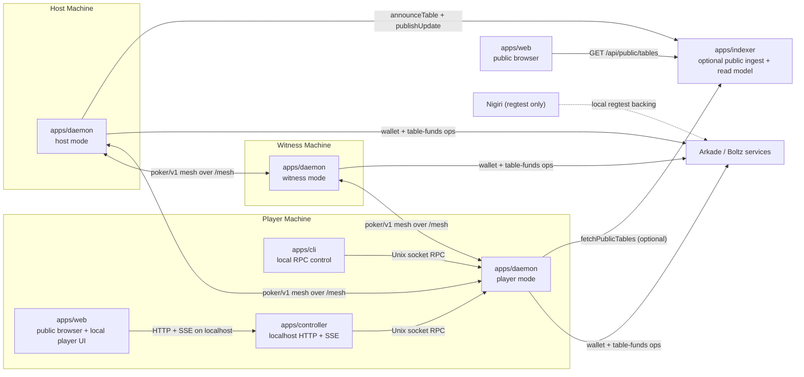
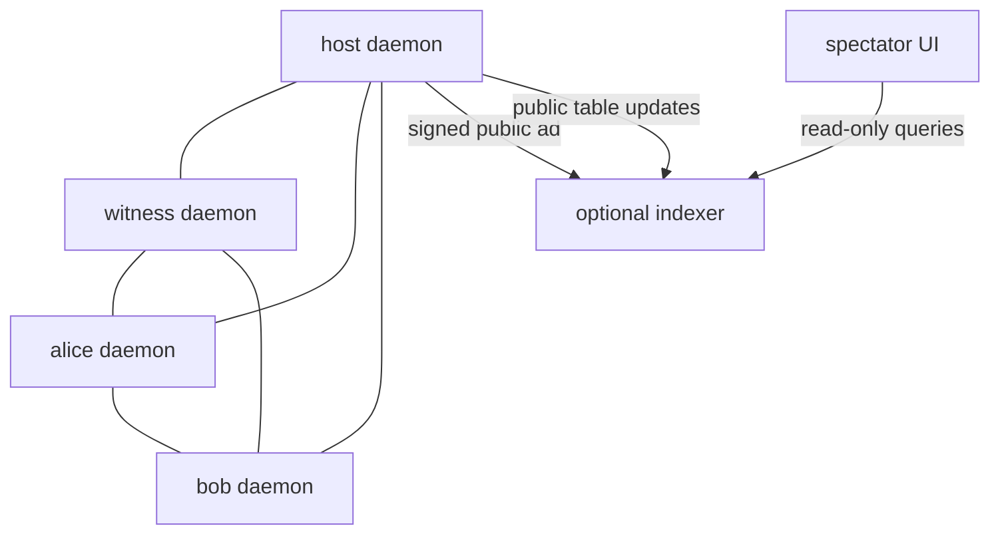
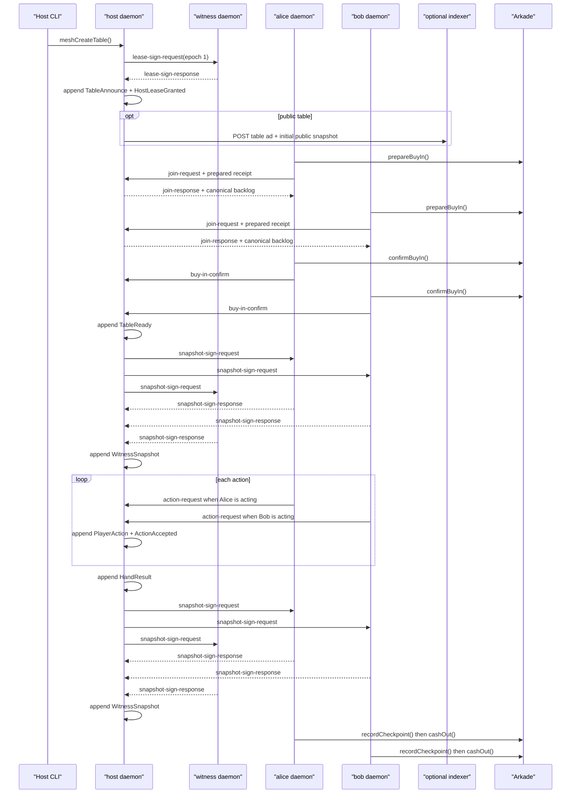
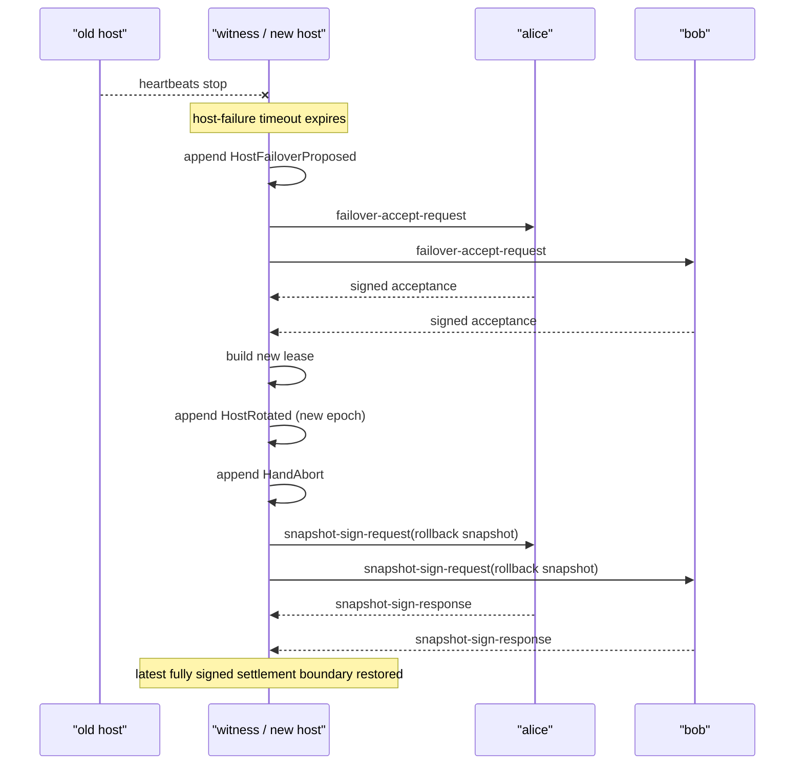

# Current Architecture

This document describes the architecture implemented today in this repository. It is intentionally current-state only and does not mix in planned or speculative designs.

For protocol rules, see [protocol.md](./protocol.md). For guarantees and assumptions, see [trust-model.md](./trust-model.md).

## Overview

Parker currently runs as a daemon mesh:

- each participant runs a local daemon process
- the CLI only controls a local daemon over Unix-socket RPC
- the local controller only controls a local daemon over HTTP and SSE backed by that same RPC
- gameplay consensus happens over daemon-to-daemon WebSockets on `/mesh`
- each player's daemon owns its own Arkade wallet interactions and table-funds state
- an optional indexer stores signed public ads and public updates for discovery
- the web app is a hybrid UI:
  - spectator reads come from the indexer
  - local player control goes through the localhost controller

The practical boundary is simple:

- `apps/daemon` is the gameplay and settlement runtime
- `apps/cli` and `apps/controller` are local control only
- `apps/indexer` is optional public ingest/read model only
- `apps/web` is a browser UI, not a mesh peer

## Component Roles

### Daemon process

`apps/daemon` starts one `ProfileDaemon` per profile. That process wraps:

- local Unix-socket RPC for the CLI
- `MeshRuntime` for poker state and peer orchestration
- `PeerTransport` for `/mesh` WebSocket connectivity
- wallet runtime and Arkade table-funds operations
- profile-local persistence for keys, peers, events, snapshots, and private hand state

This is the only runtime component that:

- appends canonical gameplay events
- collects settlement snapshot signatures
- records Arkade checkpoints
- executes cash-out and emergency-exit flows

### CLI process

`apps/cli` is a thin local control surface. It talks only to the local daemon through the profile socket at:

- `<daemonDir>/<profile>.sock`

The CLI exposes the current command groups:

- `wallet`
- `network`
- `table`
- `funds`
- `daemon`
- `bootstrap`
- `interactive`

It does not participate in the mesh directly, and it does not implement gameplay logic on its own.

### Local controller service

`apps/controller` is a loopback-only Fastify service that adapts the existing Unix-socket daemon RPC into browser-safe routes and an SSE watch stream.

It exposes:

- structured `GET` and `POST` routes under `/api/local`
- `GET /api/local/profiles/:profile/watch` as an SSE bridge over `DaemonRpcClient.watch()`
- optional same-origin serving of the built web bundle and proxied public indexer reads

It does not:

- own keys
- sign protocol objects
- join the daemon mesh
- reimplement wallet, table, or settlement logic

### Host, witness, and player modes

Host, witness, and player are daemon operating modes, not separate binaries.

- host mode creates tables, validates joins and buy-ins, orders gameplay, and collects snapshots
- witness mode signs leases, monitors host heartbeats, and can drive failover
- player mode owns bankroll, joins tables, signs actions and snapshots, and executes local settlement operations

Within a specific table, a daemon's table-local role can change after failover. The most important current example is that a witness daemon can become the new host for a later epoch.

The CLI still accepts `--mode indexer`, but the implemented public read path in this repository is the standalone [`apps/indexer`](../apps/indexer) service, not a separate consensus-participating mesh role with distinct `MeshRuntime` behavior.

### Optional indexer

`apps/indexer` is a standalone Fastify service with a SQLite-backed public read model.

It accepts:

- `POST /api/indexer/table-ads`
- `POST /api/indexer/table-updates`

And it serves:

- `GET /api/public/tables`
- `GET /api/public/tables/:tableId`

The indexer never joins consensus and never authorizes money movement. It only stores and serves public information derived from daemon state.

### Browser UI

`apps/web` now runs in two modes:

- public spectator mode from the optional indexer
- local controller mode from the localhost controller

In controller mode the browser can:

- choose a local profile
- start and inspect the local daemon
- request wallet moves
- create or join tables
- submit gameplay actions
- request renewals, cash-out, or emergency exit

Even in controller mode, the browser is still outside consensus:

- it does not hold private keys
- it does not read profile files or Unix sockets
- it does not connect to `/mesh`
- it does not sign protocol messages itself

### Arkade and Nigiri dependencies

The current runtime uses Arkade-backed wallet and table-funds operations for:

- buy-in preparation and locking
- checkpoint recording
- renewals
- cash-out
- emergency exit

In local regtest, Nigiri provides the local supporting services. The checked-in regtest flows use:

- Arkade server at `http://127.0.0.1:7070`
- Boltz API at `http://127.0.0.1:9069`
- `nigiri` for wallet funding and local service startup

## Runtime Boundaries

### Consensus boundary

Consensus is limited to:

- daemon mesh transport
- signed canonical events
- signed cooperative snapshots
- local replay of that canonical history

Everything inside this boundary lives in the daemon runtime.

### Local control boundary

The CLI crosses a local-only boundary:

- CLI issues commands over the profile socket
- daemon executes wallet, networking, and table operations

The controller crosses the same boundary over localhost HTTP and SSE:

- browser UI issues structured controller requests with origin and header checks
- controller forwards them to the daemon RPC
- daemon executes wallet, networking, and table operations

No remote peer ever talks to another peer's CLI or controller.

### Public read boundary

The indexer and UI sit outside consensus:

- hosts may publish signed ads and derived public updates to the indexer
- the UI reads the indexer over HTTP
- failures or staleness here do not change canonical money state

### Settlement boundary

Each player's daemon owns:

- wallet keys
- local table-funds state
- checkpoint records
- local cash-out and emergency-exit execution

The daemon mesh can define balances, but each player still needs their own daemon to act on those balances locally.

## Component Diagram

## Example Deployment Topologies

### Minimal private table

A minimal private table can run with:

- one host daemon
- two player daemons
- no indexer
- no UI

This can function for direct-invite play, but it has weaker recovery because witness-driven failover is unavailable.

### Public table with witness and spectators

The current public-facing topology is:

- one host daemon
- one or more player daemons
- at least one witness daemon
- one optional local controller per player machine
- optional indexer
- optional browser UI

This gives a public discovery path while keeping gameplay authority in the daemon mesh.

### Local regtest harnesses

The repository currently exercises two regtest shapes:

- `npm run dev:local` starts `host`, `witness`, `alice`, and `bob`, plus Nigiri, the controller, the indexer, and the web UI
- `make poker-regtest-round` starts `host`, `witness`, `alice`, and `bob`, plus Nigiri and the indexer
- `npm run test:mesh-regtest` starts `host`, `witness`, `alpha`, `beta`, and `gamma`, plus an in-process indexer, to cover failover and public-discovery scenarios

## Example Mesh Graph

## Gameplay / Data Flows

### Table creation and seating

1. A local CLI asks the host daemon to create a table.
2. The host daemon creates `TableAnnounce`, builds the initial lease, and gets witness lease signatures when configured.
3. The host daemon may publish the signed advertisement to the optional indexer if the table is public.
4. A player daemon receives or decodes the invite, prepares buy-in funds locally, and sends `join-request`.
5. The host daemon validates the join and appends `JoinRequest` plus `JoinAccepted` or `JoinRejected`.
6. The joining player confirms the buy-in locally and sends `buy-in-confirm`.
7. Once all seats are locked, the host appends `TableReady`, captures a signed settlement snapshot, and begins the first hand.

### Gameplay loop

1. The host daemon starts the hand, commits the deck, and privately delivers hole cards.
2. Player daemons send signed action requests to the current host.
3. The host appends canonical action events and advances public state.
4. On settlement, the host emits `HandResult` and collects a new cooperative settlement snapshot.
5. Each seated player records the resulting checkpoint locally in its Arkade table-funds state.

### Public read flow

For public tables, the host daemon can publish:

- signed table advertisements
- public table snapshots
- public hand updates
- public showdown reveals

The indexer stores those records, and the web UI polls that read model. None of those steps affect canonical gameplay state.

## Sequence Diagram

## Failure / Recovery Paths

### Between-hand host loss

If the host disappears after a clean settlement boundary:

- the witness detects missed heartbeats
- the witness gathers failover acceptances from the seated players and configured witnesses
- the witness installs a new host lease for the next epoch
- the new host schedules the next hand

No rollback is required because the table was already at a settlement boundary.

### Mid-hand host loss

If the host disappears during an active unsettled hand and there is already a fully signed settlement checkpoint:

- a witness collects failover acceptances
- the witness becomes the next host
- the new host appends `HandAbort`
- public state rolls back to the latest fully signed settlement snapshot
- the new host captures a fresh rollback snapshot before resuming play

## Recovery Diagram

## Relationship To Other Docs

- [protocol.md](./protocol.md): canonical wire format, event rules, snapshot rules, settlement rules, and failover semantics
- [trust-model.md](./trust-model.md): guarantees, trust assumptions, privacy tradeoffs, and operational failure consequences
