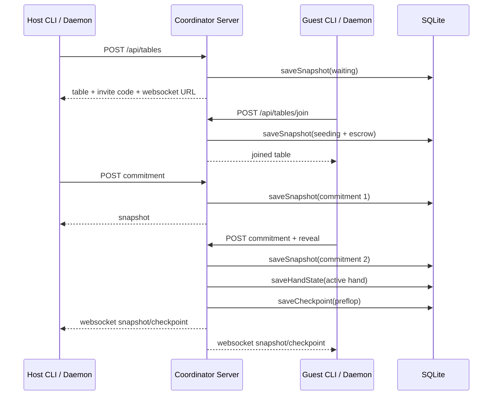
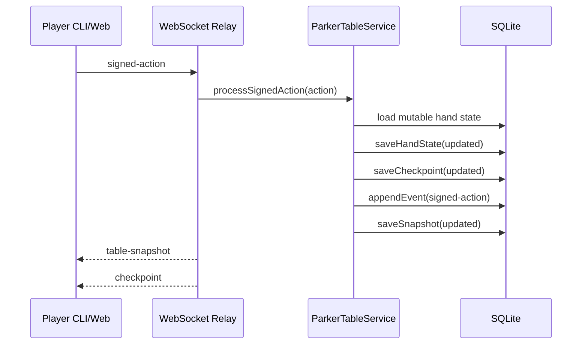
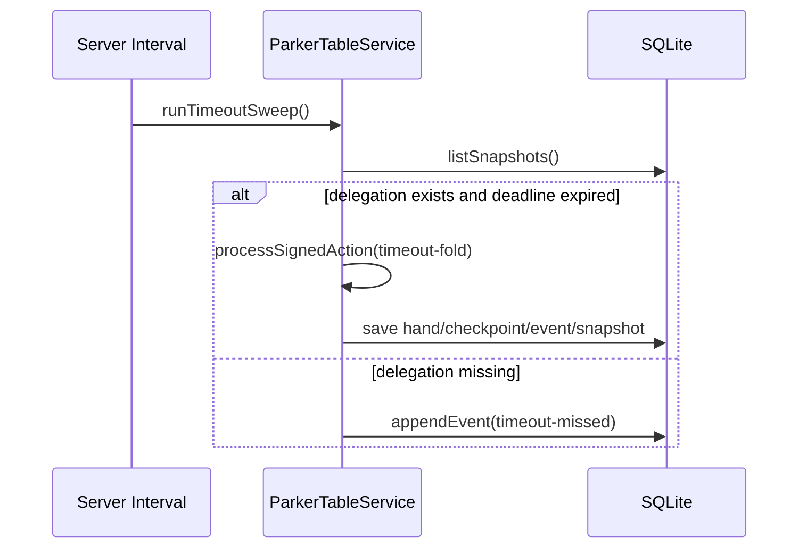
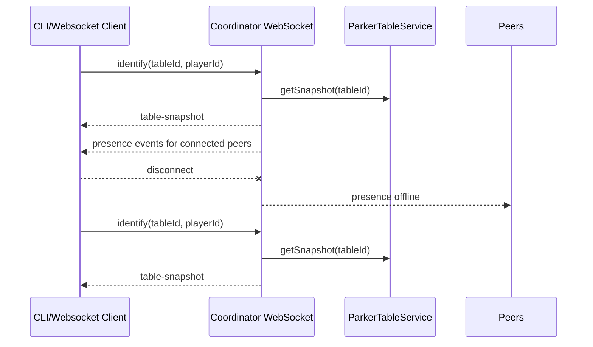

# Current Sequence Diagrams

## Table Create + Join + Commit / Reveal

```mermaid
sequenceDiagram
  participant HostCLI as Host CLI / Daemon
  participant Server as Coordinator Server
  participant GuestCLI as Guest CLI / Daemon
  participant DB as SQLite

  HostCLI->>Server: POST /api/tables
  Server->>DB: saveSnapshot(waiting)
  Server-->>HostCLI: table + invite code + websocket URL

  GuestCLI->>Server: POST /api/tables/join
  Server->>DB: saveSnapshot(seeding + escrow)
  Server-->>GuestCLI: joined table

  HostCLI->>Server: POST commitment
  Server->>DB: saveSnapshot(commitment 1)
  Server-->>HostCLI: snapshot

  GuestCLI->>Server: POST commitment + reveal
  Server->>DB: saveSnapshot(commitment 2)
  Server->>DB: saveHandState(active hand)
  Server->>DB: saveCheckpoint(preflop)
  Server-->>HostCLI: websocket snapshot/checkpoint
  Server-->>GuestCLI: websocket snapshot/checkpoint
```

## Signed Action Processing

```mermaid
sequenceDiagram
  participant Player as Player CLI/Web
  participant WS as WebSocket Relay
  participant Service as ParkerTableService
  participant DB as SQLite

  Player->>WS: signed-action
  WS->>Service: processSignedAction(action)
  Service->>DB: load mutable hand state
  Service->>DB: saveHandState(updated)
  Service->>DB: saveCheckpoint(updated)
  Service->>DB: appendEvent(signed-action)
  Service->>DB: saveSnapshot(updated)
  WS-->>Player: table-snapshot
  WS-->>Player: checkpoint
```

## Timeout Sweep

```mermaid
sequenceDiagram
  participant Timer as Server Interval
  participant Service as ParkerTableService
  participant DB as SQLite

  Timer->>Service: runTimeoutSweep()
  Service->>DB: listSnapshots()
  alt delegation exists and deadline expired
    Service->>Service: processSignedAction(timeout-fold)
    Service->>DB: save hand/checkpoint/event/snapshot
  else delegation missing
    Service->>DB: appendEvent(timeout-missed)
  end
```

## Disconnect / Resume

```mermaid
sequenceDiagram
  participant Client as CLI/Websocket Client
  participant WS as Coordinator WebSocket
  participant Service as ParkerTableService

  Client->>WS: identify(tableId, playerId)
  WS->>Service: getSnapshot(tableId)
  WS-->>Client: table-snapshot
  WS-->>Client: presence events for connected peers

  Client--xWS: disconnect
  WS-->>Peers: presence offline

  Client->>WS: identify(tableId, playerId)
  WS->>Service: getSnapshot(tableId)
  WS-->>Client: table-snapshot
```
