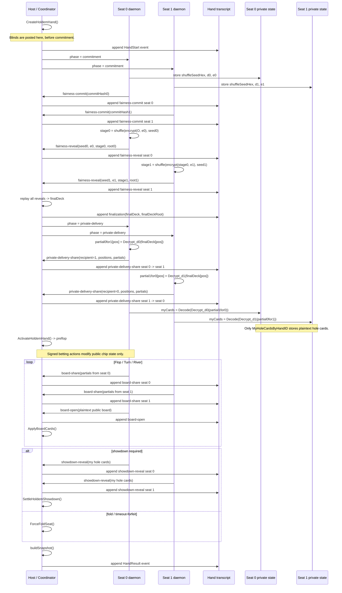
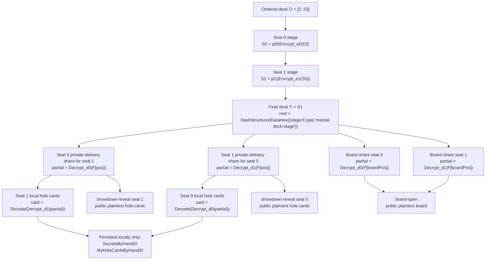

# Dealerless Protocol Deep Dive

This document describes the dealerless hand protocol implemented today in this repository. It is intentionally current-state only.

For broader system context, see [architecture.md](./architecture.md). For wire surfaces, see [protocol.md](./protocol.md). For trust boundaries, see [trust-model.md](./trust-model.md). For chip and wallet movement, see [money-flows.md](./money-flows.md).

Important scope note: dealerless transcript flow determines only card truth and public showdown facts. Once the transcript makes the money result objective, deterministic pot recovery uses pre-signed CSV recovery bundles over the shared pot exit.

## What The Runtime Guarantees Today

Parker currently runs heads-up Hold'em with a coordinator-led dealerless protocol named `dealerless-transcript-v1`.

The current runtime enforces the hidden-card invariant more strongly than the older wording in this file implied:

- `game.HoldemState` does not contain hole-card fields at all.
- `nativeActiveHand` only carries public hand state, the encrypted final deck, deadlines, and the transcript.
- honest daemons never transmit non-public hole cards in plaintext.
- `private-delivery-share` and `board-share` carry only `partialCiphertexts`, so peers receive partial decryptions rather than usable plaintext card values.
- accepted transcript records may contain plaintext `cards` only for `board-open` and `showdown-reveal`.
- `private-delivery-share`, `fairness-commit`, `fairness-reveal`, `finalization`, and `board-share` are rejected if they try to carry plaintext `cards`.
- plaintext owner-local hole cards are persisted only in table private state under `MyHoleCardsByHandID[handID]`.
- those owner-local hole cards are derived only from the opponent's `private-delivery-share` that explicitly targets the local recipient seat.

In other words: the honest protocol flow never asks a daemon to reveal non-public hole cards in plaintext to another daemon, and within the accepted runtime table model and transcript validation path no daemon can persist plaintext non-owned hole cards.

That is also why the network sanitizer can currently clone `activeHand` without per-recipient redaction: the replicated `activeHand` shape simply does not have a place for owner-local plaintext hole cards, and the replicated dealerless transcript carries only partial ciphertext shares until a card is intentionally public.

## Current Roles

- the current host/coordinator orders transcript messages, advances protocol phases, sets deadlines, appends events, and replicates table state
- each seated daemon generates its own shuffle seed and mental-poker keypair locally
- witnesses can store replicated state and take over on failover, but they do not contribute dealerless entropy

The coordinator is still important for liveness and ordering. It is not a special dealer, and it does not get a privileged deck secret.

## Core Objects And Formulas

### Ordered deck

`CreateDeck()` uses this fixed order:

1. clubs: `2c` through `Ac`
2. diamonds: `2d` through `Ad`
3. hearts: `2h` through `Ah`
4. spades: `2s` through `As`

The mental deck encodes card `i` as integer `i + 2`, so the first few encodings are:


| Card | Encoded integer | Hex |
| ---- | --------------- | --- |
| `2c` | 2               | `2` |
| `3c` | 3               | `3` |
| `Ac` | 14              | `e` |
| `2d` | 15              | `f` |


The deck starts as the ordered encoded vector:

```text
O = [2, 3, 4, ..., 53]
```

### Mental-poker field

The runtime uses:

```text
p = 0x7fffffffffffffffffffffffffffffff = 2^127 - 1
phi(p) = p - 1
```

*Each seat samples a public exponent* `e` *such that:*

```text
2 <= e <= phi(p) - 2
gcd(e, phi(p)) = 1
```

and computes the matching private exponent `d`:

```text
e * d ≡ 1 mod phi(p)
```

The card transform is ordinary modular exponentiation:

```text
Encrypt_e(x) = x^e mod p
Decrypt_d(y) = y^d mod p
```

Because exponents compose commutatively over the same modulus:

```text
Encrypt_e2(Encrypt_e1(x)) = x^(e1*e2) mod p
```

that lets every seat add its own layer, and later remove only its own layer.

### Example mental keypairs

Runtime mental keypairs are random. A valid example pair over Parker's modulus is:

```text
seat A public exponent  eA = 0x5
seat A private exponent dA = 0x66666666666666666666666666666665

seat B public exponent  eB = 0xb
seat B private exponent dB = 0x1745d1745d1745d1745d1745d1745d17
```

Those satisfy:

```text
eA * dA ≡ 1 mod (p - 1)
eB * dB ≡ 1 mod (p - 1)
```

### Example card transform

Using the sample keypairs above, the encoded card `2c` starts as:

```text
x = 0x2
```

After seat A encrypts:

```text
Encrypt_eA(x) = 0x2^0x5 mod p = 0x20
```

After seat B encrypts the already-encrypted value:

```text
Encrypt_eB(0x20) = 0x80000000000000
```

If seat B later removes only its own layer:

```text
Decrypt_dB(0x80000000000000) = 0x20
```

and seat A then removes the final layer:

```text
Decrypt_dA(0x20) = 0x2
```

which decodes back to `2c`.

### Shuffle permutation

Each seat also samples a fresh `shuffleSeedHex`.

`mentalDeckPermutation(seedHex, size)` runs a Fisher-Yates shuffle driven by:

```text
nextRandomFraction(seedHex, i)
  = uint32_be(sha256(seedHex + ":" + i)[0:4]) / 2^32
```

For each `i` from `size - 1` down to `1`:

```text
j = floor(nextRandomFraction(seedHex, i) * (i + 1))
swap(indices[i], indices[j])
```

Example for seed `abab...ab` (`"ab"` repeated 32 times):

```text
i = 51 -> fraction = 0.46798960445448756 -> j = floor(0.46798960445448756 * 52) = 24
i = 50 -> fraction = 0.07308798166923225 -> j = floor(0.07308798166923225 * 51) = 3
i = 49 -> fraction = 0.9015686521306634  -> j = floor(0.9015686521306634  * 50) = 45
```

### Per-seat deck stage

If `S(-1) = O` is the ordered encoded deck and seat `k` has public exponent `ek` plus permutation `pi_k`, then that seat's stage is:

```text
S(k) = pi_k( map(Encrypt_ek, S(k-1)) )
```

`MentalDeckStageRoot(stage)` is:

```text
sha256(
  canonical_json({
    "stage": stage,
    "type": "mental-deck-stage"
  })
)
```

### Fairness commitment

Before reveal, each seat commits to:

- `tableId`
- `handNumber`
- `seatIndex`
- `playerId`
- `phase`
- `shuffleSeedHex`
- `lockPublicExponentHex`

The commitment hash is:

```text
Commit_k = sha256(
  canonical_json({
    "handNumber": handNumber,
    "lockPublicExponentHex": ek,
    "phase": "commitment",
    "playerId": playerId,
    "seatIndex": seatIndex,
    "shuffleSeedHex": shuffleSeedHex,
    "tableId": tableId,
    "type": "dealerless-fairness-commitment"
  })
)
```

Example using:

- `tableId = 4187c6da-b781-48cc-a5b6-40df6d44c96f`
- `handNumber = 7`
- `seat 0 seed = 11...11`
- `seat 1 seed = 22...22`
- `seat 0 public exponent = 5`
- `seat 1 public exponent = b`

produces:

```text
seat 0 commitment = 87e927a97cb063e50733c69db5e674153e137268324ee325732197d8c57b10e8
seat 1 commitment = 3164b999364fbb900f39d31caeab3149ca77b83d00284c5254d3ddbe46931b75
```

### Transcript hash chain

Each transcript record is hashed without its `stepHash` and `rootHash`:

```text
stepHash_i = sha256(canonical_json(unsigned_record_i))
```

The rolling root is then:

```text
root_0 = sha256(canonical_json({
  "handId": handId,
  "handNumber": handNumber,
  "index": 0,
  "prevRoot": "",
  "stepHash": stepHash_0,
  "tableId": tableId,
  "type": "dealerless-hand-transcript-root"
}))

root_i = sha256(canonical_json({
  "handId": handId,
  "handNumber": handNumber,
  "index": i,
  "prevRoot": root_(i-1),
  "stepHash": stepHash_i,
  "tableId": tableId,
  "type": "dealerless-hand-transcript-root"
}))
```

That root is mirrored into public state as `DealerCommitment.RootHash` and into snapshots as `DealerCommitmentRoot`.

## Deal Plan And Card Positions

For heads-up with dealer seat `0`, `HoldemDealPositions(0)` yields:


| Meaning             | Positions      |
| ------------------- | -------------- |
| seat `0` hole cards | `[0, 2]`       |
| seat `1` hole cards | `[1, 3]`       |
| burn cards          | `4`, `8`, `10` |
| flop                | `[5, 6, 7]`    |
| turn                | `[9]`          |
| river               | `[11]`         |


If dealer seat is `1`, the hole-card positions swap between the seats, but board positions stay the same.

The runtime keeps the full 52-card encrypted deck even though the current game logic only consumes the usual Hold'em positions near the top.

## Full Hand Lifecycle

### 0. Table-ready checkpoint

Before a hand starts:

- the host has already accepted both seats
- `TableReady` has been appended
- a ready-state snapshot exists
- starting balances for hand `n` come from the latest snapshot with `snapshot.HandNumber < n`
- if no prior hand snapshot exists, starting balances are the players' `BuyInSats`

### 1. Hand start

`startNextHandLocked()` creates the Hold'em state immediately.

Important detail: blinds are posted before dealerless commitment begins.

For hand `1` with:

- seat 0 buy-in `4000`
- seat 1 buy-in `4000`
- small blind `50`
- big blind `100`
- dealer seat `0`

the initial Hold'em state is:

```text
seat 0 stack = 3950, roundContribution = 50, totalContribution = 50
seat 1 stack = 3900, roundContribution = 100, totalContribution = 100
pot         = 150
currentBet  = 100
minRaiseTo  = 200
phase       = commitment
```

The host also appends `HandStart`.

### 2. Commitment phase

Each seated daemon:

1. creates a fresh `shuffleSeedHex`
2. creates a fresh mental keypair `(d, e)`
3. stores those secrets in local private state under `SecretsByHandID[handID]`
4. computes `Commit_k`
5. sends `fairness-commit`

The transcript record contains only:

- `kind = fairness-commit`
- `phase = commitment`
- `playerId`
- `seatIndex`
- `commitmentHash`

It does not carry the seed, public exponent, partial decryptions, or plaintext cards.

### 3. Reveal phase

Seats reveal in seat-index order. Seat `1` cannot reveal until seat `0` has already revealed.

Each `fairness-reveal` record contains:

- `shuffleSeedHex`
- `lockPublicExponentHex`
- `deckStage`
- `deckStageRoot`

The revealed stage is the exact deck after replaying all reveals up to and including that seat.

For seat `k`, verifiers check:

1. the revealed seed and public exponent hash back to the earlier `commitmentHash`
2. replaying the revealed stages in order reconstructs the same `deckStage`
3. the stage root matches `MentalDeckStageRoot(deckStage)`

### 4. Finalization

Once all reveals are present:

1. every verifier can replay the full encrypted final deck locally
2. the host appends `finalization`
3. the record carries:
  - `deckStage = finalDeck`
  - `deckStageRoot = MentalDeckStageRoot(finalDeck)`
4. `activeHand.Cards.FinalDeck` is set to the same deck
5. the hand moves to `private-delivery`

At this point the encrypted deck is fully bound by the transcript.

### 5. Private delivery

Each seat partially decrypts the opponent's hole-card positions.

For a sender seat `s`, recipient seat `r`, and target position `pos`:

```text
partial_s->r[pos] = Decrypt_ds( finalDeck[pos] )
```

The sender publishes a `private-delivery-share` containing:

- `recipientSeatIndex`
- `cardPositions`
- `partialCiphertexts`

Verifiers check:

```text
Encrypt_es(partialCiphertexts[i]) == finalDeck[cardPositions[i]]
```

This is the key privacy property for non-public hole cards: the sender does not send plaintext card codes to the recipient or the host. It sends only its own decryption share, and that share is not enough to recover the card without the recipient's private exponent.

The recipient then locally completes decryption:

```text
plaintext[pos] = DecodeMentalCardHex( Decrypt_dr(partialCiphertexts[i]) )
```

and persists the resulting two card codes only in:

```text
MyHoleCardsByHandID[handID]
```

Because `storeLocalHoleCards()` looks up:

- the local seat's secrets
- the opponent's `private-delivery-share`
- the opponent share whose `recipientSeatIndex` equals the local seat

it cannot derive another seat's hole cards.

### 6. Betting starts at preflop

Only after both `private-delivery-share` records exist does the runtime call `ActivateHoldemHand()` and move to `preflop`.

From here:

- actions are still wallet-signed
- the host validates turn binding and legality
- the transcript does not carry betting actions
- hidden-card confidentiality still depends on the earlier dealerless records

### 7. Board reveal phases

For each street the runtime enters an explicit reveal phase:

- `flop-reveal`
- `turn-reveal`
- `river-reveal`

At each reveal phase:

1. every seat publishes a `board-share`
2. each share contains `cardPositions` and `partialCiphertexts`
3. once both shares exist, any seat with its own private exponent can decrypt the opponent's share locally and append `board-open`
4. `board-open` carries public plaintext `cards`
5. `ApplyBoardCards()` moves the Hold'em state back into the ordinary betting phase

For a board share from seat `s`, verifiers check:

```text
Encrypt_es(partialCiphertexts[i]) == finalDeck[cardPositions[i]]
```

For a `board-open` record, verifiers check the plaintext against both shares:

```text
Encrypt_e(opponent_of_share_sender)( Encode(card_i) ) == share.partialCiphertexts[i]
```

Only the `board-open` record may carry plaintext `cards`.

### 8. Showdown reveal

If showdown is required:

1. each live seat looks up the opponent's earlier `private-delivery-share` that targeted that seat
2. it decrypts the remaining layer locally
3. it appends `showdown-reveal` with its own two plaintext cards

Verifiers check each revealed hole card by re-encrypting it with that seat's public exponent and matching it against the opponent's earlier private-delivery partial:

```text
Encrypt_eseat( Encode(card_i) ) == opponent_private_delivery.partialCiphertexts[i]
```

Only `showdown-reveal` may carry plaintext hole cards, and those cards are intentionally public at that point.

### 9. Settlement

After all required showdown reveals are present, or after a forced fold:

1. the Hold'em engine settles stacks
2. the host builds public state from the settled hand
3. the host finalizes payout custody if the latest custody state does not already match the settled public money state
4. the host builds a snapshot
5. the host appends `HandResult`
6. the next hand is scheduled

If the settled money result is already objective but live cooperative payout cannot complete, the custody layer can later recover through the stored CSV recovery bundle after `U`. The dealerless transcript does not change; only the custody proof surface changes from `SettlementWitness` to `RecoveryWitness`.

### 10. Timeout and abort

Protocol deadlines apply to:

- commitment
- reveal
- private delivery
- flop/turn/river reveal
- showdown reveal

If exactly one seat is missing a required record, the runtime appends `HandAbort`, force-folds that seat, and settles the hand.

For heads-up deterministic money-resolving cases, that now means:

- the missing player becomes dead only for the contested pot
- the uncontested stack still stays with its owner
- if the live cooperative timeout successor stalls, the stored CSV recovery bundle can execute after `U`
- dealerless still does not guess hidden-card-dependent winners when the money result is not objective

If multiple seats are missing required records, the runtime aborts the hand and restores the latest fully signed snapshot instead of inventing missing hidden-card data.

## Validation On Receipt

Peers do not blindly persist replicated tables.

Before accepting a remote table, a daemon:

1. replays the transcript root
2. validates fairness commitments against reveals
3. replays every reveal stage and the final encrypted deck
4. verifies private-delivery and board-share partial ciphertexts against the final deck
5. verifies `board-open` and `showdown-reveal` plaintext against those partials
6. rejects non-public transcript records that try to carry plaintext `cards`
7. replays the public Hold'em state from snapshots plus transcript plus action log
8. validates event and snapshot history before persistence

That validation path is what upgrades the older "should not persist" statement into the current accepted-state guarantee.

## Detailed Flow Diagram




## Dataflow Diagram




## Practical Source Map

- `internal/game/mental.go`: mental deck math, stage roots, fairness commitments
- `internal/game/transcript.go`: transcript step hashes and root chain
- `internal/game/holdem.go`: phase transitions, deal positions, betting, settlement
- `internal/meshruntime/hand.go`: dealerless lifecycle, validation, local secret storage
- `internal/meshruntime/runtime.go`: hand start, snapshoting, replication, local views
