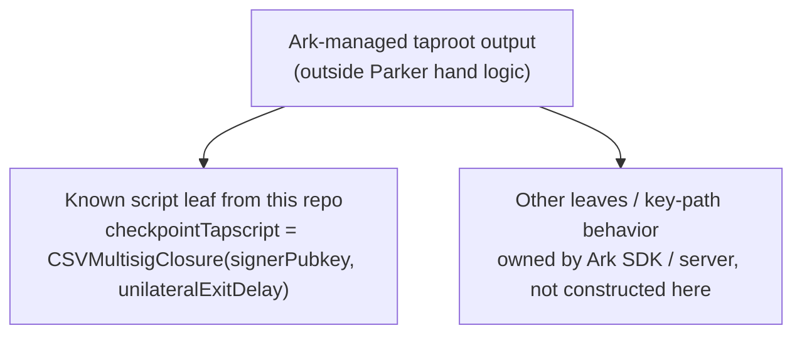
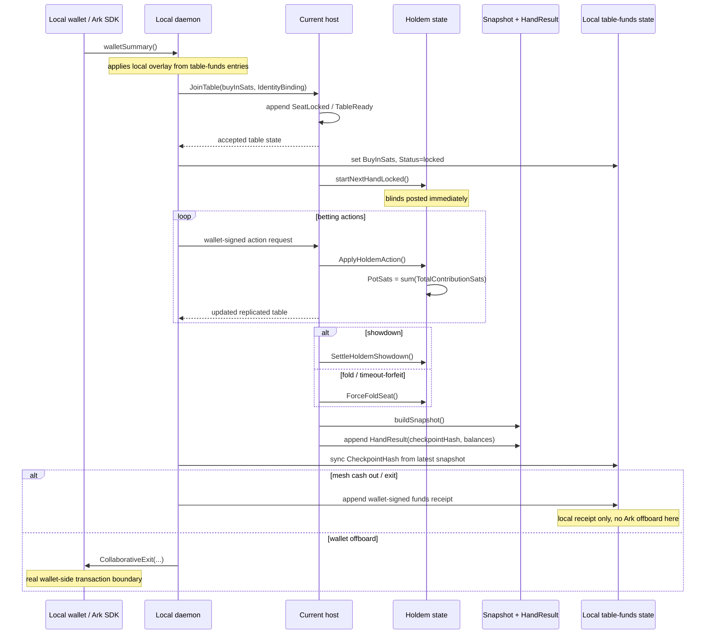

# Money Flows Deep Dive

This document describes how money moves in the Parker protocol as implemented today in this repository. It is intentionally current-state only.

For card confidentiality and dealerless transcript flow, see [dealerless.md](./dealerless.md). For broader system context, see [architecture.md](./architecture.md). For trust boundaries, see [trust-model.md](./trust-model.md).

## Short Version

The current runtime has three distinct money layers:

1. wallet money in Ark/Nigiri land
2. local table-funds overlay state
3. in-hand chip accounting inside the replicated Hold'em state

Those layers are related, but they are not the same thing.

The most important current-state facts are:

- joining a table does not create a per-table escrow transaction in this repo
- betting a hand does not create a Bitcoin or Ark transaction per action
- settling a hand does not create a Bitcoin or Ark transaction per hand
- chip movement inside a hand is application-state movement inside `game.HoldemState`
- after settlement, the resulting balances are anchored into a signed snapshot plus a `HandResult` event
- `meshCashOut`, `meshRenew`, and `meshExit` create wallet-signed local receipts, not network-enforced settlement transactions
- actual Ark transaction boundaries in this repo are wallet onboarding and wallet offboarding

So when this document says "money movement within a hand", most of that movement is replicated signed state transition, not L1/L2 transaction construction.

## The Three Money Layers

### 1. Wallet layer

`internal/wallet/runtime.go` talks to the Ark SDK.

This layer owns:

- offchain Ark balance
- onchain boarding balance
- wallet onboarding via `client.Settle(...)`
- wallet offboarding via `client.CollaborativeExit(...)`

This is the only layer in this repo that directly triggers real wallet-side transaction behavior.

### 2. Table-funds layer

`NativeTableFundsState` is a local per-profile bookkeeping layer. It tracks:

- `BuyInSats`
- `CashoutSats`
- `CheckpointHash`
- `Operations`
- `Status`

This layer is local and signed by the player's wallet key, but it is not a multi-party contract.

### 3. Hand chip-accounting layer

`game.HoldemState` carries:

- `StackSats`
- `RoundContributionSats`
- `TotalContributionSats`
- `PotSats`
- `CurrentBetSats`
- `MinRaiseToSats`

This is where blinds, calls, bets, raises, folds, and showdown awards actually move value during a hand.

## Layer Boundaries

### What does create a real wallet-side transaction here

- `walletFaucet`: external Nigiri faucet funding for regtest
- `walletOnboard`: Ark onboarding via `client.Settle(...)`
- `walletOffboard`: Ark offboarding via `client.CollaborativeExit(...)`

### What does not create a real wallet-side transaction here

- `JoinTable`
- `HandStart`
- `fairness-commit`
- `fairness-reveal`
- `private-delivery-share`
- `board-share`
- `board-open`
- player betting actions
- `HandResult`
- `meshCashOut`
- `meshRenew`
- `meshExit`

Those flows still matter, but they are protocol-state and local-receipt transitions, not chain-level spends in this repo.

## Pre-Hand Wallet Flow

### Bootstrap and wallet identity

Each profile gets a local wallet keypair. `walletSummary()` reads the base wallet balance from the Ark SDK, then applies Parker's local table-funds overlay.

### Onboard

`wallet.Onboard(profile)` does:

1. wait for boarding funds to appear
2. call `client.Settle(...)`
3. return the resulting `txid`

That is a real wallet-side boundary.

### Offboard

`wallet.Offboard(profile, address, amount)` does:

1. read the current offchain balance
2. choose a target amount
3. call `client.CollaborativeExit(...)`

That is also a real wallet-side boundary.

### Not yet implemented here

- native Go deposit quotes are not implemented
- native Go lightning withdrawals are not implemented

## Table Join And Buy-In Lock

### Join request

`JoinTable(inviteCode, buyInSats)` first checks:

```text
wallet.AvailableSats >= buyInSats
```

The request sent to the host includes:

- `BuyInSats`
- `WalletPlayerID`
- `WalletPubkeyHex`
- `ArkAddress`
- `ProtocolID`
- `Peer`
- wallet-signed `IdentityBinding`

The identity binding is signed by the wallet key over:

- `tableId`
- `peerId`
- `peerUrl`
- `protocolId`
- `protocolPubkeyHex`
- `walletPlayerId`
- `walletPubkeyHex`
- `signedAt`

### What the host does

The host:

1. validates the identity binding
2. appends `SeatLocked`
3. records `buyInSats` in the seat
4. when both seats are filled, builds ready public state and a ready snapshot
5. appends `TableReady`

### What does not happen here

No per-table escrow UTXO or VTXO is created by Parker at join time.

The buy-in becomes "locked" only in local table-funds overlay state plus replicated chip accounting.

### Local table-funds lock

When a daemon persists the accepted table, `syncPrivateAndFunds()` updates:

```text
entry.BuyInSats = seat.BuyInSats
entry.Status    = "locked"
```

That is what makes the local wallet summary stop treating those sats as freely available for another table.

## Wallet Summary Overlay Formula

`walletSummary()` computes:

```text
base = walletRuntime.GetWallet(profile)
overlay = 0

for each table entry:
  if status == "locked":
    overlay -= BuyInSats
  if status == "completed" or status == "exited":
    overlay += CashoutSats - BuyInSats

AvailableSats = base.AvailableSats + overlay
TotalSats     = base.TotalSats + overlay
```

So the table-funds layer is a local adjustment on top of Ark wallet balances.

## How A Hand Starts Financially

### Starting balances

For hand `n`, Parker chooses:

```text
startingBalance_n(player)
  = latest snapshot chip balance with snapshot.HandNumber < n
```

If no earlier hand snapshot exists:

```text
startingBalance_1(player) = seat.BuyInSats
```

### Blinds are posted before dealerless commitment

`CreateHoldemHand(...)` immediately posts blinds.

For:

- seat 0 buy-in `4000`
- seat 1 buy-in `4000`
- small blind `50`
- big blind `100`
- dealer seat `0`

the created state is:

| Step | Seat 0 stack | Seat 1 stack | Pot | Current bet |
| --- | ---: | ---: | ---: | ---: |
| before hand | 4000 | 4000 | 0 | 0 |
| after small blind | 3950 | 4000 | 50 | 0 |
| after big blind | 3950 | 3900 | 150 | 100 |

At this moment the phase is still `commitment`, not `preflop`.

That means:

- money has already moved into the pot
- card confidentiality setup has not finished yet
- betting actions are still blocked until private delivery completes

## In-Hand Chip Accounting

Inside a hand, value lives in these fields:

- `StackSats`: chips still in front of a player
- `RoundContributionSats`: chips committed during the current betting round
- `TotalContributionSats`: chips committed across the whole hand
- `PotSats`: derived pot

`PotSats` is recomputed as:

```text
PotSats = sum(player.TotalContributionSats for both players)
```

### Call

For a call:

```text
toCall = max(0, CurrentBetSats - player.RoundContributionSats)
paid   = min(toCall, player.StackSats)

player.StackSats             -= paid
player.RoundContributionSats += paid
player.TotalContributionSats += paid
```

### Bet

For a bet to total `T`:

```text
paid = T - player.RoundContributionSats

player.StackSats             -= paid
player.RoundContributionSats  = T
player.TotalContributionSats += paid

CurrentBetSats = T
LastFullRaiseSats = T
MinRaiseToSats = T + LastFullRaiseSats
```

### Raise

For a raise to total `T`:

```text
paid      = T - player.RoundContributionSats
raiseSize = T - CurrentBetSats_previous

player.StackSats             -= paid
player.RoundContributionSats  = T
player.TotalContributionSats += paid

CurrentBetSats = T

if raiseSize >= LastFullRaiseSats:
  LastFullRaiseSats = raiseSize
  RaiseLockedSeatIndex = nil
else if player is now all-in:
  RaiseLockedSeatIndex = opponent

MinRaiseToSats = CurrentBetSats + LastFullRaiseSats
```

### Street reset

When a board-open record is accepted and `ApplyBoardCards(...)` advances to the next street, the runtime resets the betting-round fields:

```text
RoundContributionSats = 0 for each player
CurrentBetSats        = 0
LastFullRaiseSats     = BigBlindSats
MinRaiseToSats        = BigBlindSats
```

`TotalContributionSats` and `PotSats` do not reset.

## Concrete Hand Example

Using the same `4000 / 4000` buy-ins and `50 / 100` blinds:

### After hand creation

| Step | Seat 0 | Seat 1 | Pot | Phase |
| --- | --- | --- | ---: | --- |
| blinds posted | stack `3950`, total `50` | stack `3900`, total `100` | 150 | `commitment` |

### After private delivery and preflop starts

The money state is unchanged. Only hidden-card readiness changes.

### If seat 0 calls and seat 1 checks

| Step | Seat 0 | Seat 1 | Pot | Phase |
| --- | --- | --- | ---: | --- |
| seat 0 calls `50` | stack `3900`, total `100` | stack `3900`, total `100` | 200 | `preflop` |
| seat 1 checks | stack `3900`, total `100` | stack `3900`, total `100` | 200 | `flop-reveal` |

### If flop opens and seat 1 bets `100`, seat 0 calls

| Step | Seat 0 | Seat 1 | Pot | Phase |
| --- | --- | --- | ---: | --- |
| flop opens | stack `3900`, round `0`, total `100` | stack `3900`, round `0`, total `100` | 200 | `flop` |
| seat 1 bets to `100` | stack `3900`, total `100` | stack `3800`, total `200` | 300 | `flop` |
| seat 0 calls `100` | stack `3800`, total `200` | stack `3800`, total `200` | 400 | `turn-reveal` |

No wallet transaction has happened anywhere in that sequence. All of it is replicated game-state accounting.

## Fold Settlement

If one player folds, the runtime first checks whether the remaining player has contributed more than the folded player.

If so:

```text
unmatched = remaining.TotalContributionSats - folded.TotalContributionSats
```

That unmatched amount is returned to the remaining player before awarding the pot.

Then the pot is awarded to the sole remaining active player.

This prevents a folded-against player from winning their own unmatched overcall back as part of the opponent's pot.

## Showdown Settlement

At showdown:

1. the runtime collects public `showdown-reveal` cards for each live player
2. it scores each 7-card hand
3. it determines the winner set
4. it awards:

```text
baseShare = PotSats / len(winners)
remainder = PotSats % len(winners)
```

Each winner gets `baseShare`, and the first winners in iteration order get one extra chip while remainder is non-zero.

In the current heads-up implementation that means:

- single winner: winner gets the full pot
- split pot: each player gets `PotSats / 2`, with an odd chip going to the first winner in iteration order

## Signatures That Authorize Money-Relevant State

### Join binding

Wallet-signed.

Authorizes:

- claimed player identity
- claimed peer identity
- claimed protocol identity
- claimed table join

### Action request

Wallet-signed via:

```text
nativeActionAuthPayload(tableId, playerId, handId, epoch, decisionIndex, action, signedAt)
```

This authorizes a particular betting action against a specific hand/epoch/action index.

### Dealerless hand messages

Wallet-signed via `nativeHandMessageAuthPayload(...)`.

These do not move chips directly, but they authorize the hidden-card protocol steps required before the hand can legally continue.

### Events

Protocol-signed by the current host via `appendEvent(...)`.

These anchor:

- `SeatLocked`
- `TableReady`
- `HandStart`
- `HandAbort`
- `HandResult`
- host rotations

### Snapshots

Protocol-signed by the builder via `buildSnapshot(...)`.

This snapshot is the checkpoint used later by table-funds receipts.

## Snapshot And Checkpoint Hash

After a settled hand, `finalizeSettledHandLocked()`:

1. builds public state from the settled hand
2. builds a snapshot
3. computes:

```text
checkpointHash = HashStructuredDataHex(snapshot_without_signatures)
```

4. appends `HandResult` with:
   - `balances`
   - `checkpointHash`
   - `handId`
   - `publicState`
   - `transcriptRoot`
   - `winners`

The snapshot itself contains:

- `ChipBalances`
- `PotSats`
- `Phase`
- `LatestEventHash`
- `DealerCommitmentRoot`
- signer metadata and protocol signature

That snapshot is Parker's current durable settlement checkpoint.

## Local Funds Operations

After a snapshot exists, the local daemon can create a wallet-signed funds receipt.

`NativeTableFundsOperation` includes:

- `amountSats`
- `checkpointHash`
- `createdAt`
- `kind`
- `networkId`
- `operationId`
- `playerId`
- `provider = arkade-table-funds/v1`
- `signatureHex`
- `signerPubkeyHex`
- `status`
- `tableId`

### Receipt signature formula

The daemon signs this unsigned payload with the wallet private key:

```text
{
  "amountSats": amountSats,
  "checkpointHash": checkpointHash,
  "createdAt": nowISO(),
  "kind": kind,
  "networkId": network,
  "operationId": randomUUID(),
  "playerId": walletPlayerId,
  "provider": "arkade-table-funds/v1",
  "signerPubkeyHex": walletPubkeyHex,
  "status": status,
  "tableId": tableId
}
```

### Cash out

`meshCashOut` does:

1. read `LatestFullySignedSnapshot`
2. set `amount = snapshot.ChipBalances[myPlayerID]`
3. set `checkpointHash = snapshotHash(snapshot)`
4. build a `kind = cashout`, `status = completed` receipt
5. append it to local table-funds state

It does not call the Ark SDK and does not offboard funds by itself.

### Exit

`meshExit` is similar, but uses:

- `kind = emergency-exit`
- `status = exited`

Again, this is a local signed receipt path, not a Bitcoin transaction builder.

### Renew

`meshRenew` builds:

- operation `kind = renewal`
- operation `status = renewed`

but writes the table-funds entry back with:

```text
entry.Status = "locked"
```

So the table remains locally locked for another round of play.

## Example Local Cash-Out Receipt

Illustrative shape:

```json
{
  "amountSats": 4150,
  "checkpointHash": "9f...checkpoint...",
  "createdAt": "2026-03-29T12:34:56Z",
  "kind": "cashout",
  "networkId": "regtest",
  "operationId": "5c2d4c6a-3f90-49d0-82d4-6f8f0ff19d40",
  "playerId": "player-abc123...",
  "provider": "arkade-table-funds/v1",
  "signatureHex": "64-byte-compact-secp256k1-signature-hex",
  "signerPubkeyHex": "02...",
  "status": "completed",
  "tableId": "table-123"
}
```

## Tapscript And Tap Tree Boundary

The current Parker hand protocol does not build a per-hand tap tree.

There is no code in the hand flow that:

- constructs a betting-output script tree
- asks players to sign a per-street settlement transaction
- issues per-action VTXOs
- rolls the pot through taproot spends during the hand

The only tapscript-related code in this repo is the Ark compatibility helper:

```text
deriveCheckpointTapscript(signerPubkey, unilateralExitDelay)
```

in `internal/wallet/ark_compat.go`.

That helper derives a checkpoint script using Ark's `CSVMultisigClosure`:

```text
checkpointTapscript
  = CSVMultisigClosure(
      pubkeys = [signerPubkey],
      locktime = RelativeLocktime(unilateralExitDelay)
    )
```

with:

- block-based locktime when `unilateralExitDelay < 512`
- second-based locktime when `unilateralExitDelay >= 512`

Example inputs:

- `signerPubkey = 0279be667ef9dcbbac55a06295ce870b07029bfcdb2dce28d959f2815b16f81798`
- `unilateralExitDelay = 512`

Important limitation:

- Parker uses that helper only to normalize Ark server info compatibility
- Parker does not build or spend the full taproot tree in this repository
- any larger Ark tap tree structure is external to Parker's hand logic here

## Ark Tap Tree Diagram

This diagram is intentionally scoped to what this repo actually knows.



## Full Money Flow Diagram



## Practical Source Map

- `internal/meshruntime/runtime.go`: join flow, funds overlay, snapshots, local funds receipts
- `internal/meshruntime/hand.go`: settlement handoff, abort path, `HandResult`
- `internal/game/holdem.go`: blinds, action math, pot math, fold/showdown settlement
- `internal/wallet/runtime.go`: onboarding, offboarding, Ark SDK boundary
- `internal/wallet/ark_compat.go`: checkpoint tapscript compatibility derivation
